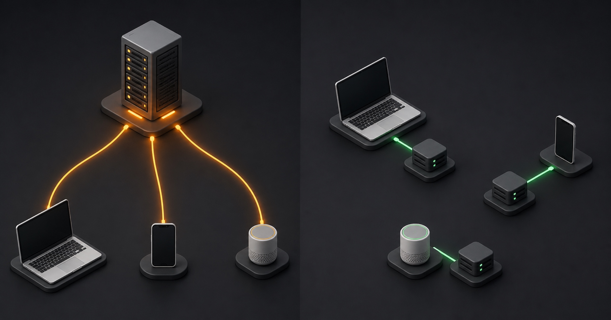

Wenn wir von der Cloud sprechen, klingt das oft so, als würden Daten irgendwo unsichtbar im Internet liegen. Tatsächlich
stehen dahinter reale Rechenzentren. Öffnest du eine Website, müssen Texte, Bilder und andere Dateien von dort zu deinem
Endgerät gelangen. Je größer die Entfernung und je ungünstiger die Verbindung, desto eher entstehen Verzögerungen.

Edge-Computing setzt genau an diesem Punkt an: Daten und Rechenleistung werden näher an den Ort gebracht, an dem sie
benötigt werden.

## Was bedeutet „Edge“?

„Edge“ bedeutet übersetzt „Rand“. Gemeint ist der Rand eines Netzwerks und damit die Infrastruktur, die sich möglichst
nah an den Nutzer*innen oder an der Quelle der Daten befindet. Das kann ein regionales Rechenzentrum sein, aber auch ein
Router, ein Smartphone oder ein vernetztes Gerät.

Vereinfacht lässt sich das mit einem Handelsunternehmen vergleichen. Statt jede Bestellung aus einem einzigen zentralen
Lager zu versenden, werden häufig benötigte Produkte auf regionale Verteilzentren aufgeteilt. Kund*innen erhalten ihre
Bestellung aus einem Lager in der Nähe. Der Weg ist kürzer und das zentrale Lager wird entlastet.

Beim Edge-Computing werden zwar keine Pakete verteilt, das Prinzip ist aber ähnlich: Inhalte oder Berechnungen finden
dort statt, wo sie schneller verfügbar sind.

*Links: Ein zentraler Server versorgt alle Endgeräte über lange Wege. Rechts: Mehrere Edge-Standorte verkürzen die
Datenwege.*

## Ist Edge-Computing dasselbe wie die Cloud?

Edge-Computing ersetzt die Cloud nicht zwangsläufig, sondern ergänzt sie. Datenbanken und zentrale Systeme können
weiterhin in einem klassischen Rechenzentrum liegen. Der Netzwerkrand übernimmt dann Aufgaben, bei denen kurze Wege
einen Vorteil bringen.

Bei einer statischen Website bedeutet das zum Beispiel, dass fertige HTML-Dateien, Bilder und Stylesheets auf mehrere
Standorte verteilt werden. Dieses Prinzip kennt man auch von einem Content Delivery Network, kurz CDN. Edge-Computing
geht noch einen Schritt weiter: Neben Dateien kann auch Programmcode am Netzwerkrand ausgeführt werden, etwa um eine
Anfrage zu prüfen oder Inhalte anzupassen.

## Welche Vorteile hat das?

Edge-Computing kann mehrere praktische und wirtschaftliche Vorteile haben:

- **Kürzere Ladezeiten:** Daten müssen im Idealfall keine großen geografischen Entfernungen zurücklegen.
- **Weniger Belastung:** Ein zentraler Server muss nicht jede Anfrage allein verarbeiten.
- **Geringerer Datenverkehr:** Inhalte und Ergebnisse können näher am jeweiligen Einsatzort bereitgestellt werden.
- **Bessere Skalierbarkeit:** Last lässt sich auf eine verteilte Infrastruktur aufteilen.
- **Potenzielle Kostenvorteile:** Weniger benötigte Serverleistung und Bandbreite können die laufenden Kosten reduzieren.

Für Nutzer*innen bleibt die Technik meist unsichtbar. Sie merken lediglich, dass eine Website schnell reagiert und
zuverlässig erreichbar ist.

## Wie ich Edge-Computing nutze

Auch diese Website und einige meiner Kundenprojekte laufen über das Edge-Netzwerk von Cloudflare. Viele davon sind
statische Websites. Beim Veröffentlichen wird eine fertige Version aus HTML, CSS, JavaScript und Bildern erstellt.
Anders als bei einer klassischen dynamischen Website muss kein dauerhaft laufender Server jede einzelne Seite bei jedem
Aufruf neu zusammensetzen.

Cloudflare verteilt diese Dateien über sein Netzwerk und liefert sie über einen geeigneten Standort aus. In meinem
konkreten Setup entstehen für die Bereitstellung solcher statischen Websites praktisch keine laufenden Serverkosten.
Das passt auch zum aktuellen Kostenmodell von Cloudflare Pages: Anfragen an rein statische Dateien sind dort
[kostenlos und unbegrenzt](https://developers.cloudflare.com/pages/functions/pricing/). Dynamische Funktionen werden
dagegen separat betrachtet. Kostenlos ist eine Website deshalb natürlich nicht: Domains, Entwicklung, Wartung und
zusätzliche Dienste müssen weiterhin berücksichtigt werden.

Für einfache Unternehmensseiten, Portfolios oder Blogs halte ich dieses Modell für sehr sinnvoll. Es ist schnell,
zuverlässig und verursacht wenig technischen Verwaltungsaufwand.

## Wo liegen die Grenzen?

Nicht jede Website ist statisch. Shops, Plattformen mit Benutzerkonten oder Anwendungen mit aktuellen Daten benötigen
häufig Datenbanken und weitere Hintergrunddienste. Auch diese Systeme können Edge-Technologien nutzen, die übrige
Infrastruktur verschwindet dadurch aber nicht automatisch. Edge-Computing ist daher kein kostenloser Ersatz für jeden
Server, sondern eine Architekturentscheidung, die zum jeweiligen Projekt passen muss.

## Fazit

Beim Edge-Computing geht es im Kern um Nähe: Daten und Berechnungen werden dort bereitgestellt, wo sie benötigt werden.
Das verkürzt Wege, entlastet zentrale Systeme und kann sowohl die Geschwindigkeit als auch die Wirtschaftlichkeit eines
digitalen Angebots verbessern.

Für meine Website und einige Kundenprojekte ist die Kombination aus statischem Aufbau und dem Cloudflare-Netzwerk eine
pragmatische Lösung. Sie bietet eine gute Performance, ist wartungsarm und kommt bei der reinen Bereitstellung nahezu
ohne laufende Serverkosten aus.

Eine ausführlichere technische Erklärung findest du im Cloudflare-Lernzentrum:
[Was ist Edge-Computing?](https://www.cloudflare.com/de-de/learning/serverless/glossary/what-is-edge-computing/)
