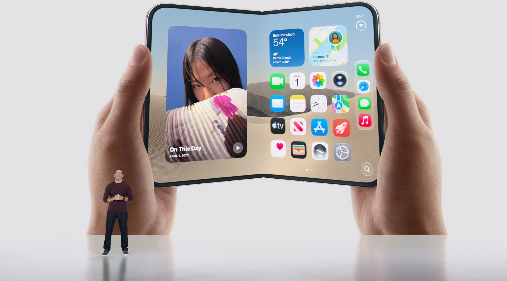
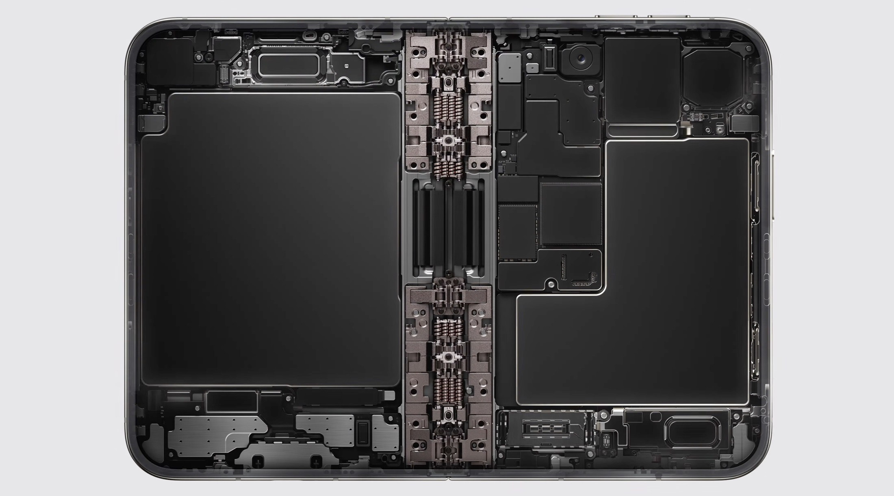
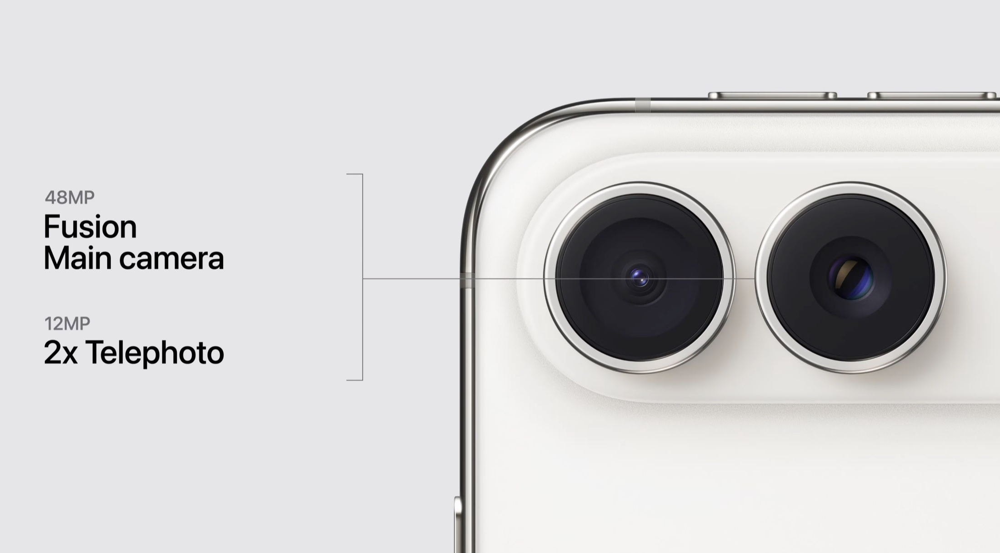
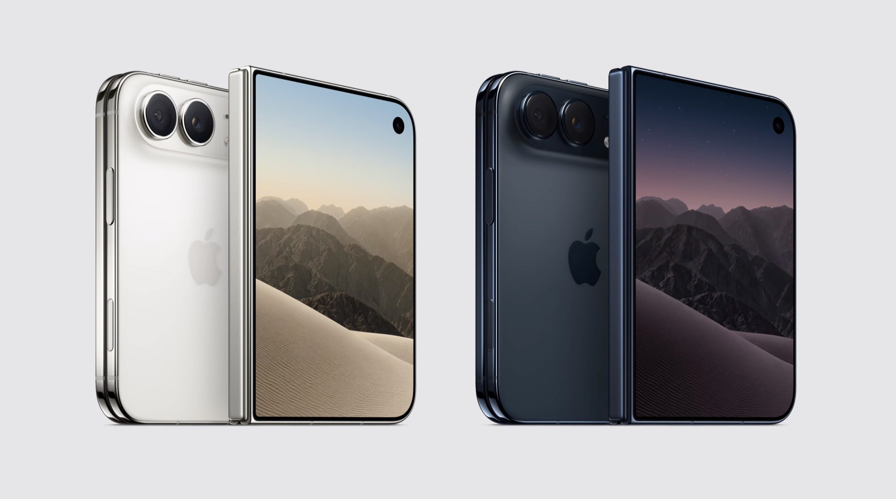

Apple hat auf seinem Event am 9. September 2026 das **iPhone Duo** vorgestellt. Es ist das erste iPhone mit faltbarem
Display. Geschlossen lässt es sich wie ein normales Smartphone nutzen. Aufgeklappt bietet es mehr Platz für Apps,
Videos und Multitasking und erinnert damit eher an ein kleines iPad.

## Zwei Displays und ein angepasstes iOS

Außen hat das iPhone Duo ein 5,4 Zoll großes Display. Im Inneren befindet sich ein 7,6 Zoll großes Super Retina XDR
Display. Laut Apple ist es die größte Bildschirmfläche, die das Unternehmen bisher in einem iPhone verbaut hat. Der
Rahmen besteht aus Titan der Güteklasse 5. Apple bezeichnet das geöffnete Duo außerdem als sein bisher dünnstes iPhone,
nennt in der Präsentation allerdings keine genaue Dicke.

iOS 27 wurde an das neue Format angepasst. Apps können nebeneinander laufen. Auch zwei Fenster derselben App sind
möglich. Beim Öffnen wechselt der Inhalt vom äußeren auf das innere Display und nutzt dort automatisch die größere
Fläche. Später im Jahr 2026 soll auch der Apple Pencil mit USB-C auf beiden Displays funktionieren. Zum Entsperren dient
Touch ID im seitlichen Einschaltknopf.

*Aufgeklappt bietet das iPhone Duo Platz für zwei Apps oder größere Ansichten.*

## A20 Pro, zwei Akkus und eSIM

Im iPhone Duo arbeitet derselbe A20 Pro wie im iPhone 18 Pro. Der Prozessor allein ist damit kein Alleinstellungsmerkmal
des faltbaren Modells. Für das Duo gibt Apple dennoch bis zu 35 Prozent mehr dauerhaft abrufbare Leistung als beim
iPhone 17 Pro an. Eine Dampfkammer soll dabei helfen, die Leistung unter Last länger zu halten. Wie viel davon im Alltag
ankommt, müssen unabhängige Tests zeigen. Das Duo nutzt außerdem das neue C2-Mobilfunkmodem und ist weltweit
ausschließlich für eSIM ausgelegt.

In jeder Gerätehälfte steckt ein eigener Akku. Das System steuert beide gemeinsam, sodass sie sich wie ein einzelner
Akku verhalten. Für die Videowiedergabe nennt Apple bis zu 31 Stunden auf dem inneren und bis zu 44 Stunden auf dem
äußeren Display. Wer beide Bildschirme etwa gleich häufig nutzt, soll mit einer Ladung bis zu 24 Stunden erreichen. Beim
Schnellladen soll der Ladestand in rund 20 Minuten auf bis zu 50 Prozent steigen.

*In beiden Hälften des iPhone Duo befindet sich jeweils ein Akku.*

Das Gehäuse ist nach IP68 gegen Staub und Wasser geschützt. Das Gerät erscheint in den Farben **Star White** und
**Night Sky**.

## Zwei 48-Megapixel-Kameras

Das Kamerasystem besteht aus einer 48-Megapixel-Hauptkamera und einer 48-Megapixel-Ultraweitwinkelkamera. Zusätzlich
bietet die Hauptkamera einen zweifachen Zoom mit 12 Megapixeln in optischer Qualität. Videos nimmt sie in 4K mit bis zu
120 Bildern pro Sekunde auf.

Außen sitzt eine Center-Stage-Kamera. Eine weitere FaceTime-Kamera ist unter dem inneren Display verborgen. Beim
Fotografieren kann das Außendisplay als Vorschau dienen. Die fotografierte Person sieht dadurch direkt den
Bildausschnitt. Die neue Funktion Smart Take erkennt auf dem Gerät, wann alle Personen bereit sind, und löst dann
automatisch aus.

*Apple setzt beim iPhone Duo auf zwei 48-Megapixel-Kameras.*

## Preis und Verfügbarkeit

In den USA startet das iPhone Duo mit 256 GB Speicher bei **1.999 US-Dollar**. Verfügbar sind Speichervarianten bis 2 TB.
Vorbestellungen beginnen am 16. Oktober, erhältlich ist das Gerät ab dem 23. Oktober 2026. Einen Preis für Deutschland
hat Apple zum Zeitpunkt der Veröffentlichung noch nicht genannt.

## Mein Fazit

Aus meiner Sicht ist beim iPhone Duo nicht der A20 Pro der spannendste Punkt. Den gibt es schließlich auch im iPhone 18
Pro. Interessanter ist das Zusammenspiel aus den beiden Displays, dem Scharnier und einem dafür angepassten iOS. Genau
dieses Zusammenspiel muss im Alltag zeigen, ob das Duo einen echten Mehrwert bietet oder vor allem ein sehr teures
iPhone mit mehr Bildschirmfläche ist.

Mit einem Startpreis von 1.999 US-Dollar ist die erste Generation klar kein Gerät für den Massenmarkt. Offen bleibt
außerdem, wie gut sich Scharnier und Faltdisplay über längere Zeit bewähren. Apple verspricht eine weniger sichtbare
Falz und eine hohe Widerstandsfähigkeit. Ob das im Alltag funktioniert, müssen unabhängige Tests zeigen.

*Das iPhone Duo erscheint in Star White und Night Sky.*

Quelle: [Apple Event vom 9. September 2026](https://www.apple.com/apple-events/event-stream/)
