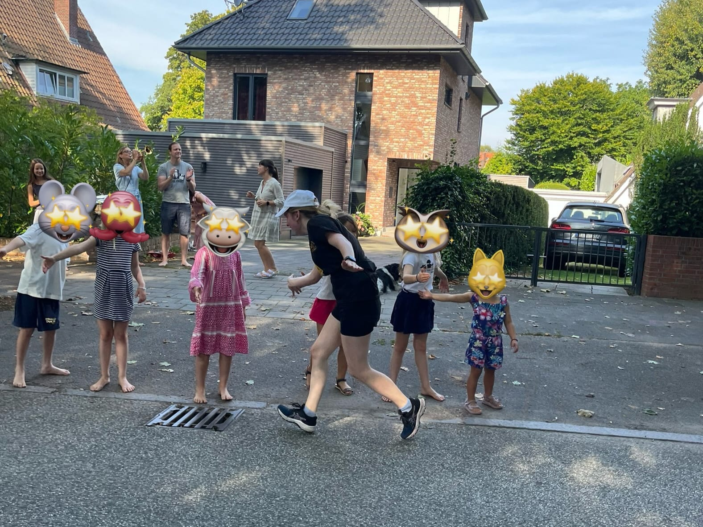
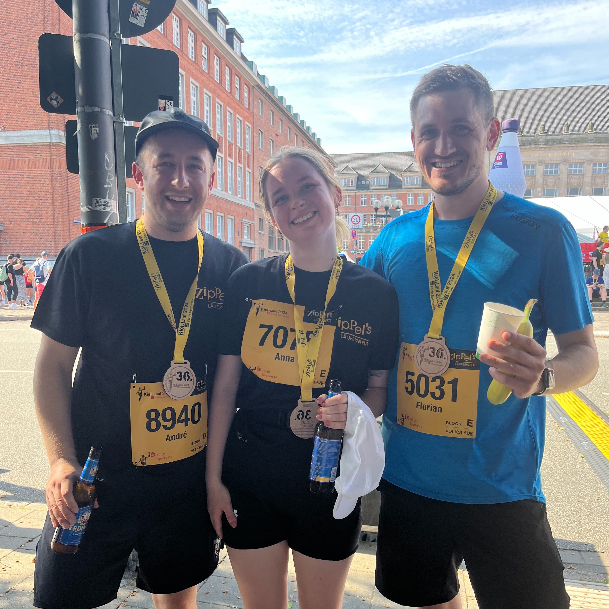
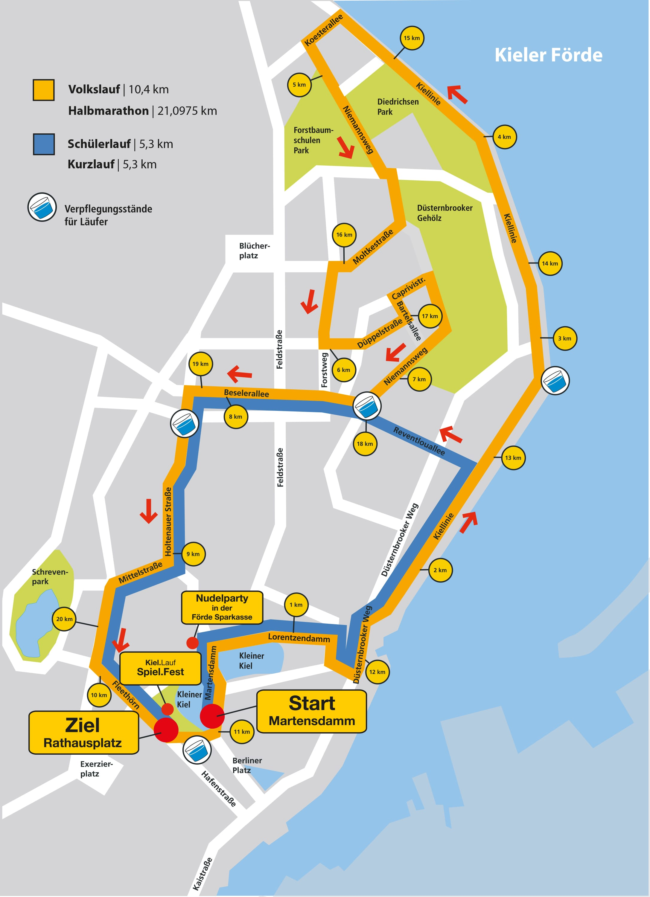

Am 8. September 2024 war es wieder soweit: Der Kiellauf lockte tausende Läufer in die Landeshauptstadt
Schleswig-Holsteins. Ich war dabei – zusammen mit Anna, die ihren ersten Wettkampf bestritt, und Florian.
Es war ein Lauf, der uns in vielerlei Hinsicht forderte!

### Eine energiegeladene Kulisse

Die Stimmung am Start war elektrisierend. Überall motivierte Gesichter, Zuschauer, die ihre Schilder hochhielten,
und Musik, die durch die Luft schallte. Auf den ersten Kilometern führte die Strecke an der Kieler Förde entlang – mit
dem Blick aufs Wasser und leider ohne einer angenehmen Brise, sondern die Sonne knallte bereits gut um 10 Uhr.

### Hitze und Höhenmeter

Mit Temperaturen von 30 Grad im Schatten wurde der Lauf schnell zur Herausforderung. Die Strecke führte uns durch
Wohngebiete, wo uns Kinder abklatschten und Zuschauer mit Gartenschläuchen Abkühlung verschafften. Trotzdem war die
Hitze gnadenlos. Unser Durchschnittstempo lag bei 8:30 Minuten pro Kilometer, aber genau richtig, um die Strecke gemeinsam zu meistern.

Besonders die Steigungen auf der Kösterallee und im Düsternbrooker Gehölz verlangten uns einiges ab. Anna hielt tapfer
durch, auch wenn wir gelegentlich Pausen einlegen mussten.

### Das Ziel: Ankommen

Nach den letzten Metern bergab auf der Holtenauer Straße war die Ziellinie in Sicht. Zuschauer feuerten uns
lautstark an, und die letzten Schritte fühlten sich fast schwerelos an. Als wir das Ziel erreichten, war ich unglaublich
stolz auf Anna. Sie hatte ihren ersten Wettkampf erfolgreich gemeistert – und das unter denkbar schwierigen Bedingungen.

Florian, der die Strecke in starken 54:44 Minuten lief, empfing uns im Ziel.

### Ein Lauf, der bleibt

Der Kiellauf 2024 war für uns nicht nur ein sportliches Event, sondern auch eine gemeinsame Erfahrung, die wir so
schnell nicht vergessen werden. Die Hitze, die Anstrengung, aber auch die Unterstützung und die Stimmung entlang der
Strecke haben diesen Tag zu etwas Besonderem gemacht.

Für uns steht fest: Das war nicht unser letzter Lauf. Aber hoffentlich beim nächsten Mal mit etwas milderen Temperaturen!

