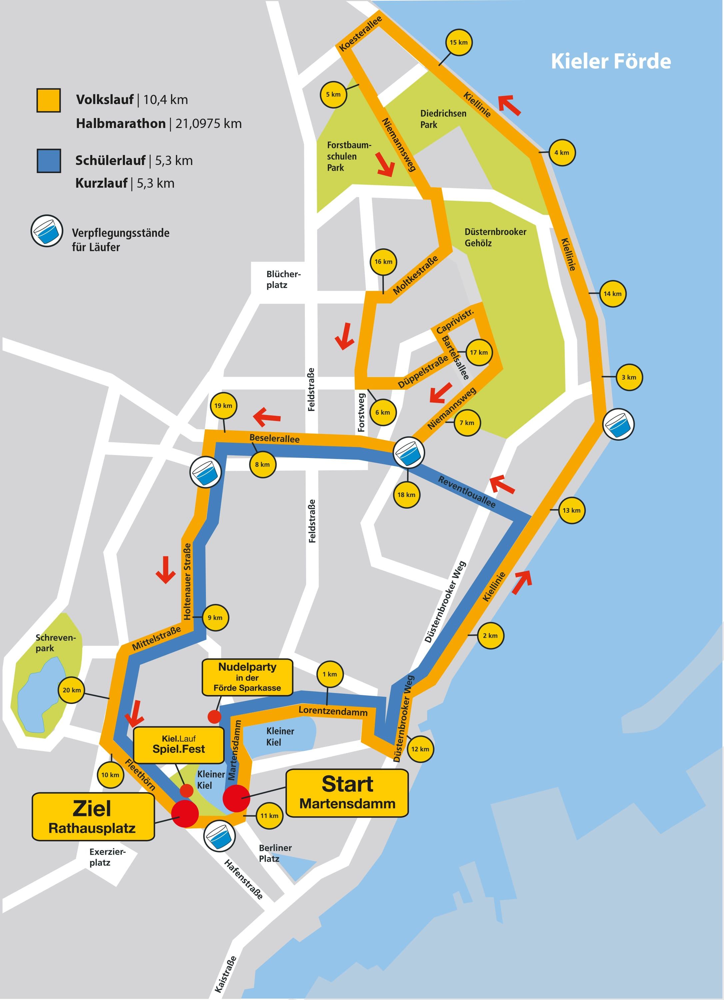

Am 8. September 2024 war es wieder soweit: Der Kiellauf lockte tausende Läufer in die Landeshauptstadt Schleswig-Holsteins. Ich war gemeinsam mit Florian dabei. Es war ein Lauf, der uns in vielerlei Hinsicht forderte!

### Eine energiegeladene Kulisse

Die Stimmung am Start war elektrisierend. Überall motivierte Gesichter, Zuschauer, die ihre Schilder hochhielten, und Musik, die durch die Luft schallte. Auf den ersten Kilometern führte die Strecke an der Kieler Förde entlang, mit Blick aufs Wasser, aber leider ohne eine angenehme Brise. Stattdessen knallte bereits gegen 10 Uhr die Sonne.

### Hitze und Höhenmeter

Mit Temperaturen von 30 Grad im Schatten wurde der Lauf schnell zur Herausforderung. Die Strecke führte durch Wohngebiete, wo Kinder die Läufer abklatschten und Zuschauer mit Gartenschläuchen für Abkühlung sorgten. Trotzdem war die Hitze gnadenlos.

Besonders die Steigungen auf der Kösterallee und im Düsternbrooker Gehölz verlangten einiges ab. Bei diesen Bedingungen ging es vor allem darum, das eigene Tempo zu finden und sicher durchzukommen.

### Das Ziel: Ankommen

Nach den letzten Metern bergab auf der Holtenauer Straße war die Ziellinie endlich in Sicht. Zuschauer feuerten uns lautstark an und die letzten Schritte fühlten sich fast schwerelos an.

Florian absolvierte die Strecke in starken 54:44 Minuten.

### Ein Lauf, der bleibt

Der Kiellauf 2024 war nicht nur ein sportliches Event, sondern eine Erfahrung, die so schnell nicht in Vergessenheit geraten wird. Die Hitze, die Anstrengung, aber auch die Unterstützung und die Stimmung entlang der Strecke haben diesen Tag zu etwas Besonderem gemacht.

Für mich steht fest: Das war nicht mein letzter Lauf. Aber hoffentlich beim nächsten Mal mit etwas milderen Temperaturen!

