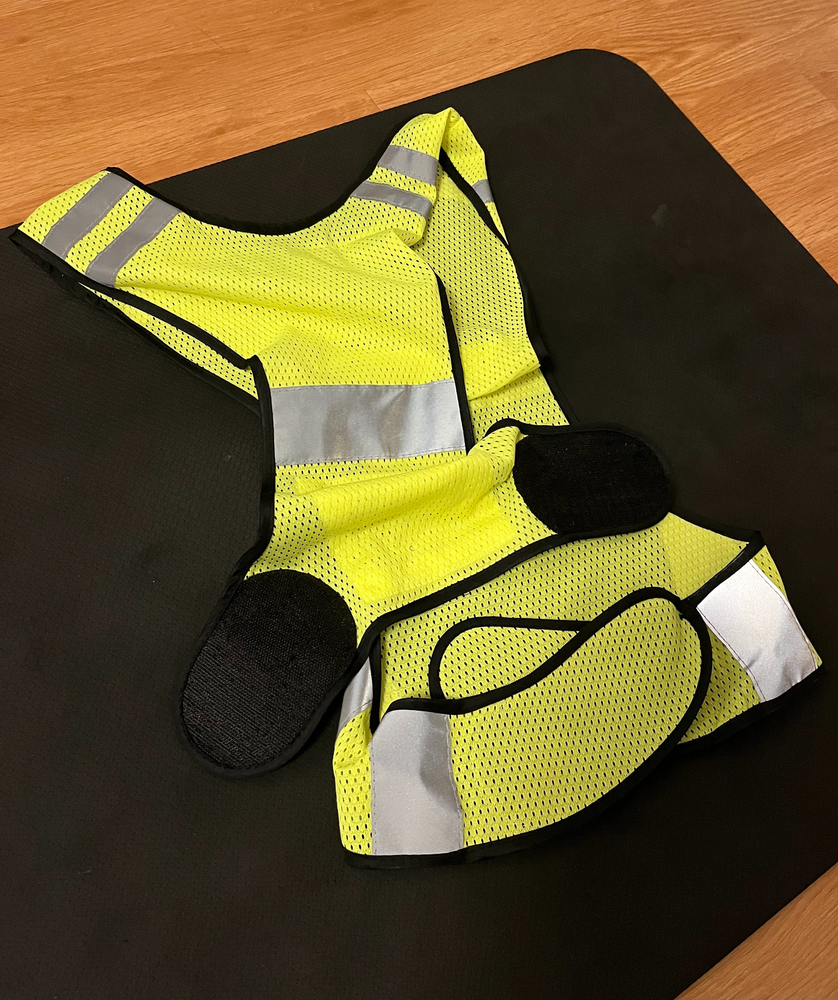
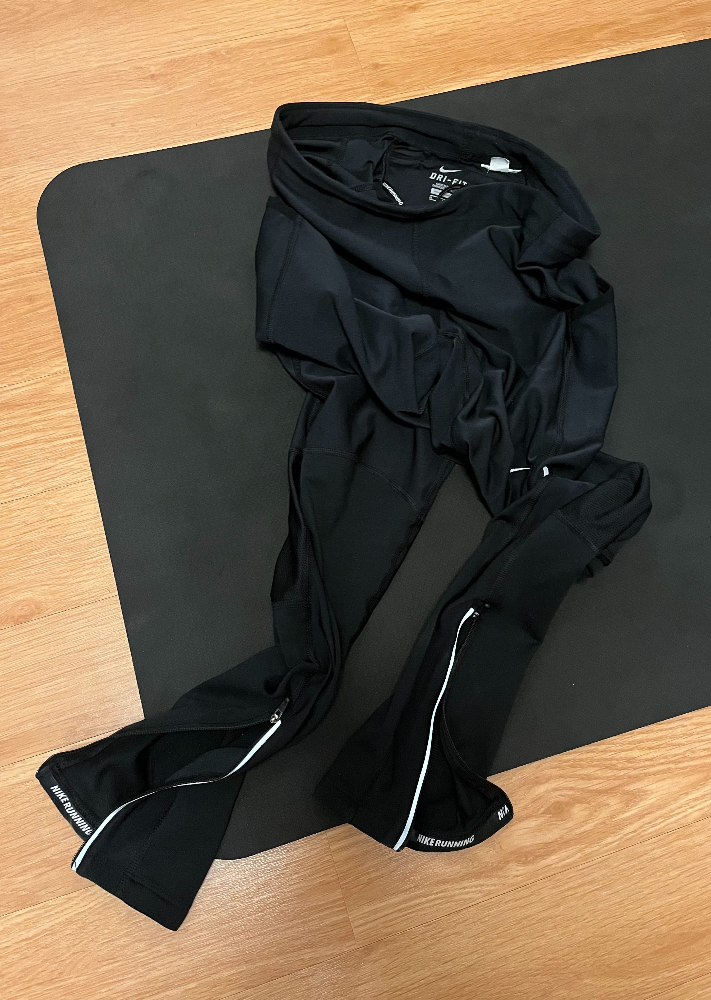
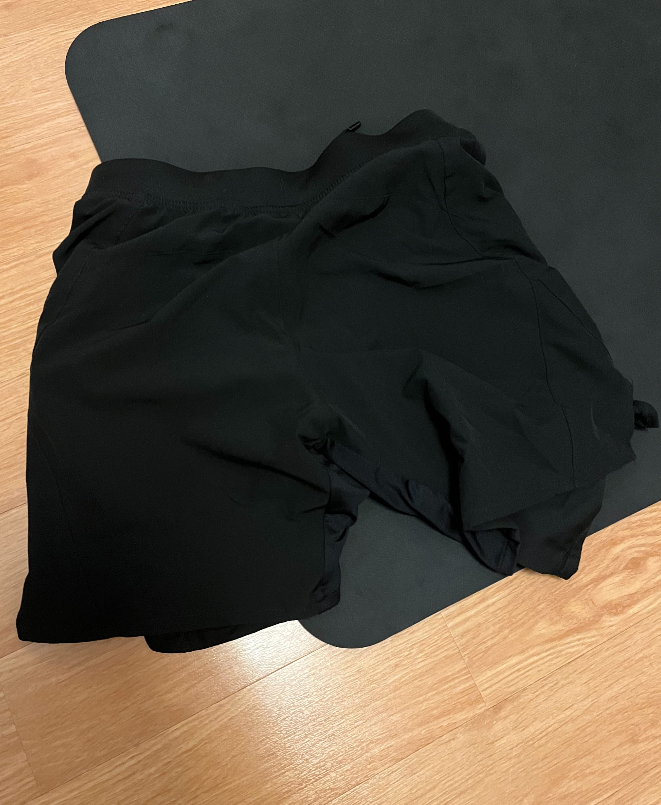
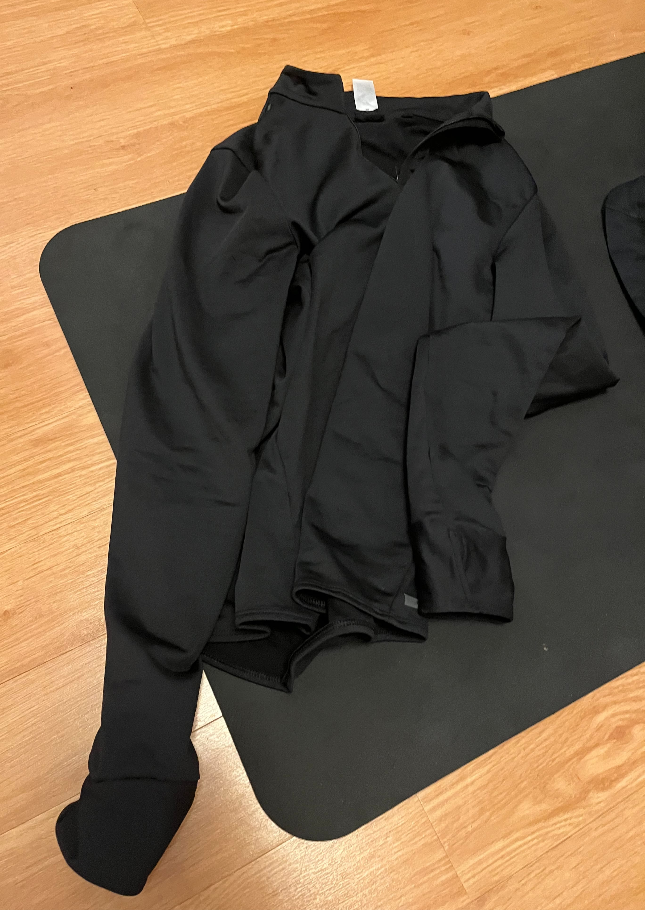
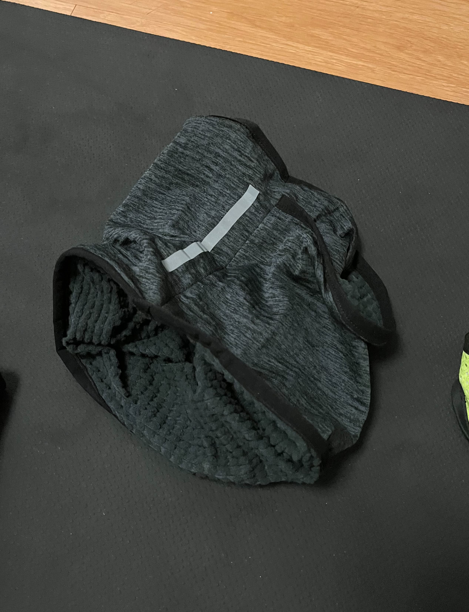
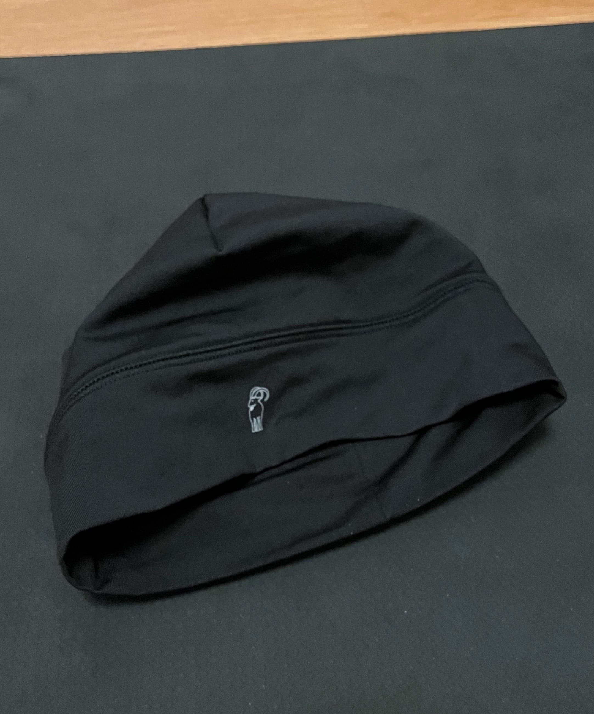
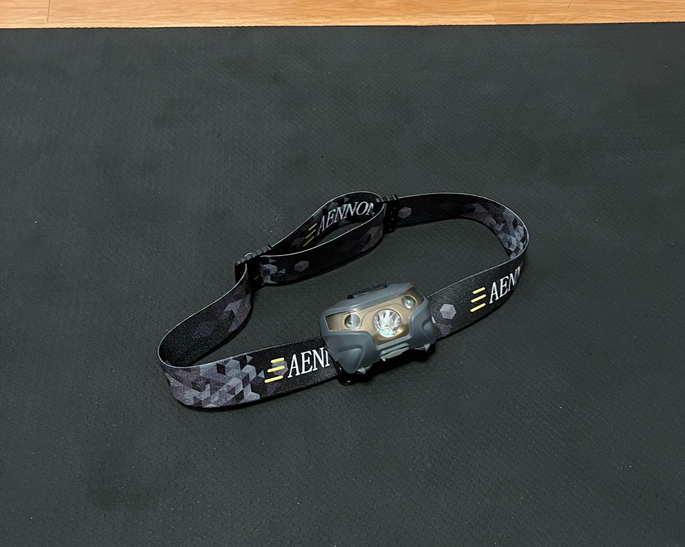
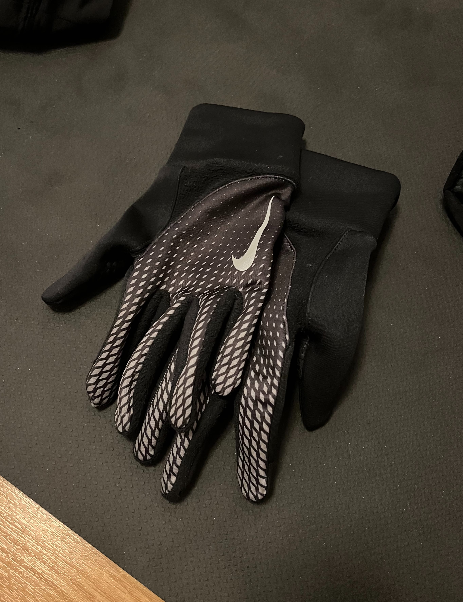

**Laufen macht dir Spaß, aber bei kaltem, dunklem Wetter lässt du es lieber bleiben?
Mit der richtigen Ausrüstung und ein paar einfachen Tipps kann das Laufen bei Minusgraden richtig Spaß machen! Hier
teile ich, was mir hilft sicher durch den Winterlauf zu kommen.**

## Tipps und Hinweise

Wie du dir wahrscheinlich schon gedacht hast, ist das Aufwärmen zu Hause im Warmen besonders wichtig. Ein Kaltstart
draußen sollte niemand riskieren! Achte darauf, auch ausreichend zu trinken, auch wenn du keinen Durst verspürst.

Lauf lieber langsamer und achte auf deine Sicherheit, besonders bei Glätte. Und noch ein wichtiger Tipp: Zieh dich nicht
zu warm an! Wenn du zu Beginn etwas fröstelst, ist das völlig in Ordnung. Dein Körper wird schnell warm, und du wirst
die Temperatur gut aushalten können. Jeder muss für sich selbst herausfinden, was am besten funktioniert, auch bei der
Wahl der richtigen Ausrüstung.

## Meine Ausrüstung

Kommen wir zu meiner Ausrüstung, die auf jeden Fall umfangreicher ist als die
von [Danny (Daniel Hernes)](https://www.instagram.com/danny_run/) im Winter. Fast alle
Kleidungsstücke sind atmungsaktiv.

### Schuhe

Ich laufe mit meinen normalen Laufschuhen, ohne extra Grip oder wasserdichte Varianten. Es gibt zwar viele Modelle mit
speziellem Grip für winterliche Bedingungen, aber auf den meisten Strecken habe ich bisher keine extremen Bedingungen
erlebt. Wenn Schnee liegt, komme ich mit meinen gewohnten Schuhen gut zurecht.

### Reflektierende Laufwarnweste

Das wohl wichtigste Kleidungsstück für meine Sicherheit – gerade im Dunkeln. Mit einer reflektierenden Laufweste werde
ich von Autos und Radfahrern nicht übersehen.

### Lauftight (Leggings)

Sobald die Temperaturen unter 4 Grad fallen, greife ich zu einer Lauftight. Ich besitze sowohl eine dünnere als auch
eine etwas dickere Variante, die mich bei kälteren Temperaturen gut warm hält. Empfehlenswert ist auch, eine
reflektierende Tight zu wählen, um besser sichtbar zu sein.

### 2-in-1 Laufhose

Über meine Tight ziehe ich eine meiner 2-in-1 Laufhosen an. Kleiner Tipp: Diese Hosen sind bei bekannten Marken oft
teuer, aber im Decathlon-Shop findet man ebenso gute Modelle zu einem deutlich besseren Preis.

### Langarmshirt und T-Shirt

Ich trage über meinem Laufshirt ein etwas wärmeres Langarmshirt mit Daumenlöchern und hohem Kragen. Diese Kombination
hilft mir, die Körperwärme zu halten, ohne dass es zu warm wird.

### Schlauchtuch

Damit der Hals schön warm bleibt kann ich ein Schlauchtuch empfehlen.
Besonders praktisch, wenn die Luft sehr kalt sein sollte, kann ich es über mein Gesicht ziehe.

### Funktionelle Laufmütze

Eine atmungsaktive Sportmütze ist für mich wichtig, damit meine Ohren nicht frieren. Ich überlege auch aktuell auch mal
Ohrenwärmer auszuprobieren.

### Laufjacke oder Regenjacke

Über mein Langarmshirt ziehe ich entweder meine lockere Laufjacke oder, wenn es regnet, meine Regenjacke an. So bin ich
für alle Wetterbedingungen gut vorbereitet.

### Stirnlampe

Ein absolutes Must-Have für die dunklen Wintertage: eine Stirnlampe. Besonders auf unbeleuchteten Wegen oder im Wald
sorgt sie dafür, dass ich den richtigen Weg finde und mögliche Hindernisse frühzeitig erkenne oder Rehaugen zum
Vorschein bringt.

### Laufhandschuhe

Laufhandschuhe sind für mich ein Muss, um bei kaltem Wetter die Hände warm zu halten, ohne dass sie schwitzen – ideal
für die kalte Jahreszeit!
Gerne auch reflektierend.

## Abschluss

Das war ein Überblick über meine Winterlauf-Ausrüstung und -Tipps. Ich hoffe, ich konnte den einen oder anderen von euch
motivieren, es selbst auszuprobieren. Trotz der kalten Temperaturen und der Dunkelheit kann Laufen im Winter unglaublich
erfrischend und spaßig sein – vor allem mit der richtigen Ausrüstung!