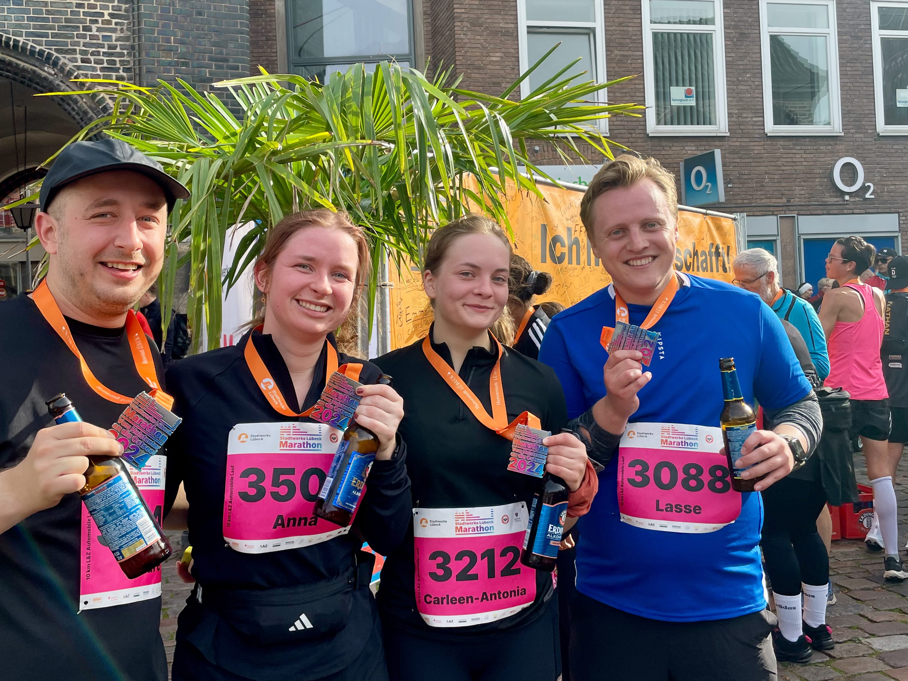

## Mein Lauf beim Stadtwerke Lübeck Marathon 2024

Am 20. Oktober war es wieder soweit: Der Stadtwerke Lübeck Marathon lockte über 6000 Teilnehmerinnen und Teilnehmer in
die Altstadt – ein neuer Rekord. Ich war mittendrin und lief den 10 Kilometer Lauf, eine Strecke, die mich vor ungeplante
Herausforderungen stellte.

### Ein Tag voller Energie und guter Stimmung

Meine Freundin Anna und ich machten uns früh auf den Weg nach Lübeck. Bei unseren Freunden Carleen und Lasse konnten wir
uns umziehen, bevor wir gemeinsam in die Altstadt aufmachten. Schon dort war die Atmosphäre spürbar: Überall waren
Läufer und Zuschauer, die sich auf den Tag freuten.

Am Start- und Zielbereich herrschte reges Treiben, begleitet von Musik und Applaus. DJs entlang der Strecke sorgten für
die passende Stimmung, und die motivierende Stimmung der Zuschauer war spürbar – insbesondere, wenn sie meinen Namen
riefen, der auf der Startnummer stand.

### Gute Vorsätze und unerwartete Schmerzen

Mein Ziel war klar: die 10 Kilometer in unter einer Stunde zu laufen, mit einer Pace von etwa 5:50 min/km. Anfangs lief
es gut, obwohl ich schnell merkte, dass ich etwas zu warm angezogen war. Die Sonne kam früh heraus, der Himmel war
wolkenlos, und es wurde wärmer, als ich erwartet hatte.

Bis Kilometer 5 lief alles nach Plan, doch dann bekam ich plötzlich starke Schmerzen im linken Fuß. Jeder Schritt tat
weh, und ich war kurz davor, den Lauf abzubrechen. Irgendwie habe ich mich aber durchgebissen – auch wenn es im
Nachhinein vielleicht nicht die beste Entscheidung war.

### Das Ziel erreicht – mit gemischten Gefühlen

Die letzten Kilometer wurden zu einem Kraftakt. Im Ziel stoppte die Uhr schließlich bei 1 Stunde und 3 Minuten. Es war
nicht die Zeit, die ich mir erhofft hatte, aber unter den Umständen bin ich froh, überhaupt angekommen zu sein.

Die Erleichterung im Ziel war riesig – nicht nur wegen der Schmerzen, sondern auch wegen der tollen Verpflegung. Es gab
kostenloses Obst, Energieriegel, alkoholfreies Bier und verschiedene Getränke. Auch entlang der Strecke war die
Organisation top: Wasserstationen und sogar Snacks hielten uns Läufer bei Kräften.

### Was bleibt: Erfahrungen und neue Pläne

Der Stadtwerke Lübeck Marathon hat mir gezeigt, wie wichtig es ist, auf den eigenen Körper zu hören. Direkt nach dem
Lauf habe ich einen Termin beim Orthopäden gemacht, um die Ursache der Schmerzen zu klären.

Ob ich nächstes Jahr wieder in Lübeck laufe? Vielleicht. Die Atmosphäre, die Altstadt-Strecke und die tolle Organisation
machen Lust auf mehr. Wenn ich zurückkomme, dann besser vorbereitet – und hoffentlich schmerzfrei.
